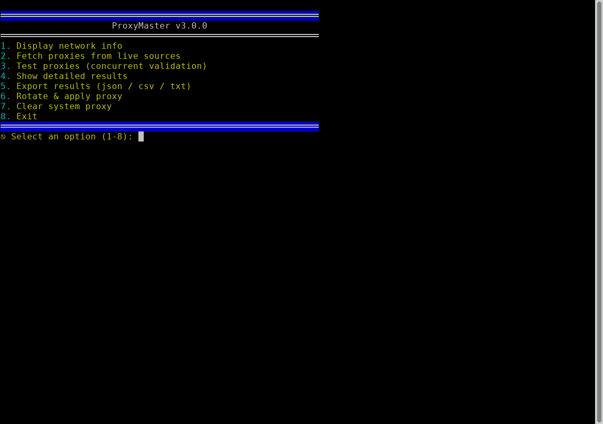
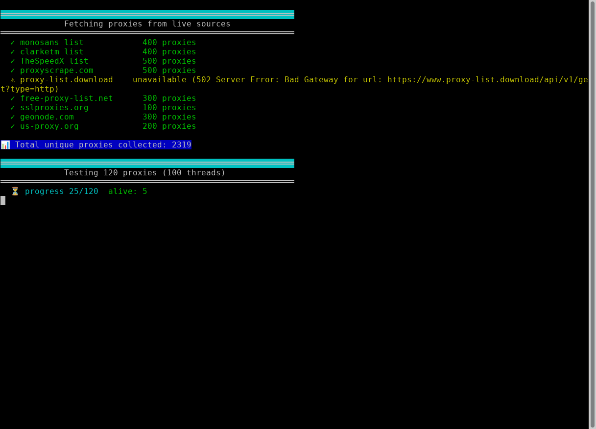
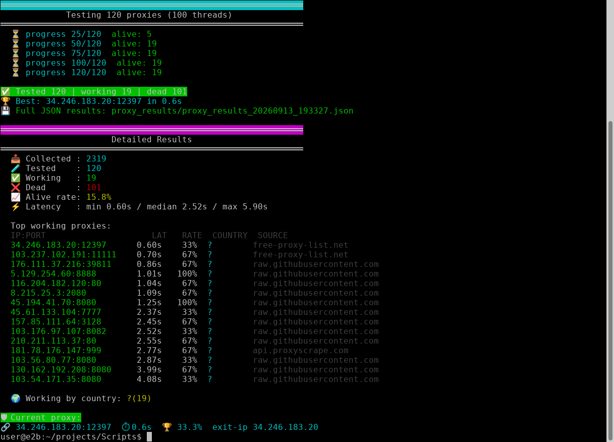
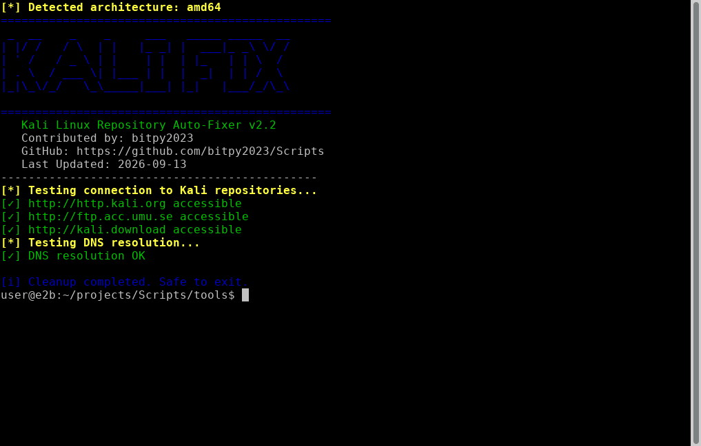

# 🛰️ ProxyMaster

**Cross-platform free-proxy toolkit** — collect thousands of public HTTP/HTTPS
proxies from live sources, validate them concurrently, benchmark latency,
export the results (JSON / CSV / TXT) and rotate/apply a working proxy.

[](https://github.com/bitpy2023/Scripts/actions/workflows/ci.yml)


---

## ✨ Features

- 🔎 **Multi-source harvesting** — 9 live providers (free-proxy-list, sslproxies,
  proxyscrape, geonode and curated GitHub lists); typically **2000+ unique proxies**.
- ⚡ **Concurrent validation** — up to 100 threads, with per-proxy latency,
  success-rate and exit-IP detection.
- 📊 **Detailed report** — totals, alive rate, min/median/max latency, top
  proxies and a country breakdown.
- 💾 **Export everything** — full JSON report plus CSV and plain `ip:port` TXT.
- 🔁 **Proxy rotation** — re-validates healthy proxies and applies the next best
  one system-wide (Windows `netsh`, macOS `networksetup`, GNOME on Linux;
  otherwise prints `export` commands).
- 🌐 **Network inspector** — public IP, country, ISP, hostname and interfaces.
- 🖥️ **Two UIs** — an interactive colored menu *and* a non-interactive CLI for
  scripts/automation.

---

## 📸 Screenshots

### Interactive menu & network information


### Harvesting proxies from live sources


### Validation report (working proxies, latency, exit IP)


### Kali repository connection tester (`tools/kalifix.sh`)


---

## 📦 Installation

```bash
git clone https://github.com/bitpy2023/Scripts.git
cd Scripts
python -m venv .venv
# Windows:   .venv\Scripts\activate
source .venv/bin/activate
pip install -r requirements.txt
```

> `PySocks` is included so Tor-backed sources work if a local Tor service is
> running on port 9050 (optional — most sources need no Tor).

---

## 🚀 Usage

### Interactive console

```bash
python src/proxymaster.py
```

```text
1. Display network info
2. Fetch proxies from live sources
3. Test proxies (concurrent validation)
4. Show detailed results
5. Export results (json / csv / txt)
6. Rotate & apply proxy
7. Clear system proxy
8. Exit
```

### Command line (automation)

```bash
# show network information
python src/proxymaster.py --info

# fetch + test 300 proxies, then export a JSON report
python src/proxymaster.py --fetch --test --limit 300 --timeout 8 --export json

# CSV / TXT exports
python src/proxymaster.py -f -t --limit 500 --export csv
python src/proxymaster.py -f -t --export txt

# all options
python src/proxymaster.py --help
```

Reports are written to the `proxy_results/` directory (git-ignored).

---

## 📁 Project structure

```
Scripts/
├── src/
│   └── proxymaster.py        # ProxyMaster (CLI + interactive console)
├── tools/
│   ├── kalifix.sh            # Kali Linux repository/DNS fixer (sudo, -t to test)
│   └── fix_templates.py      # Django template-layout helper
├── assets/screenshots/       # screenshots used in this README
├── requirements.txt
└── .github/workflows/ci.yml  # smoke-test CI
```

### `tools/kalifix.sh` — Kali repository fixer

Repairs Kali APT repositories, DNS and BBR tuning for restricted networks.

```bash
chmod +x tools/kalifix.sh
sudo tools/kalifix.sh --help
sudo tools/kalifix.sh --test      # only test repo/DNS connectivity
sudo tools/kalifix.sh --normal    # normal fix (recommended)
sudo tools/kalifix.sh --aggressive  # alternative mirrors for restricted regions
```

---

## ⚙️ Notes

- Applying the system proxy on **Windows requires an elevated (Administrator)
  terminal** for `netsh winhttp`.
- Free public proxies are short-lived; the validation step is what makes the
  list usable. Re-run it before every session.
- Use the exported proxies responsibly and in line with the target services'
  terms.

## 📄 License

MIT — see [LICENSE](LICENSE).
